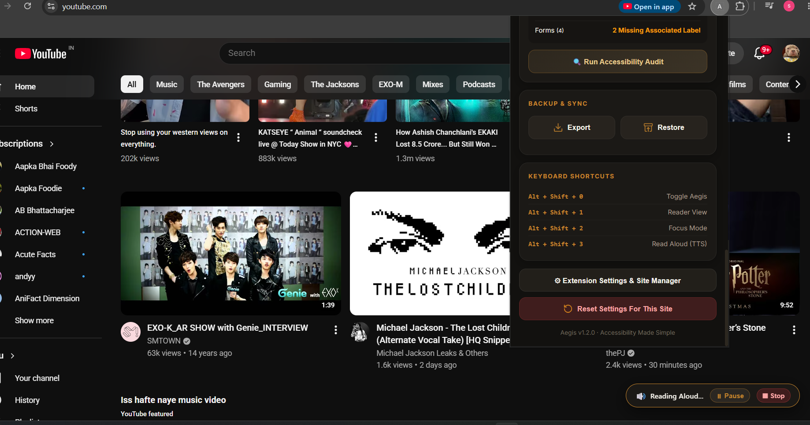
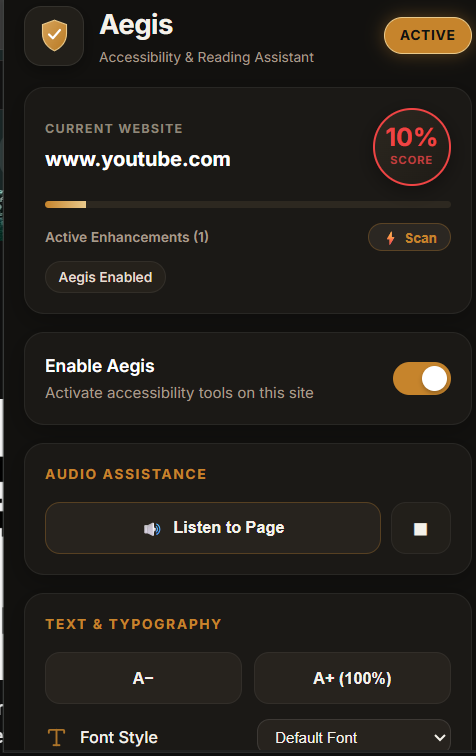
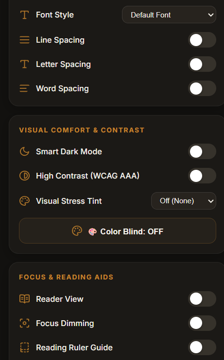
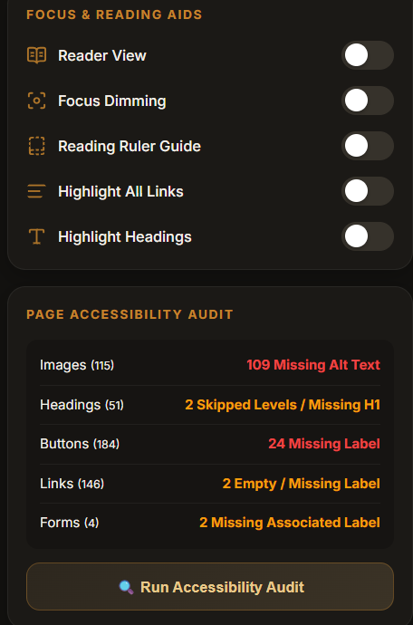
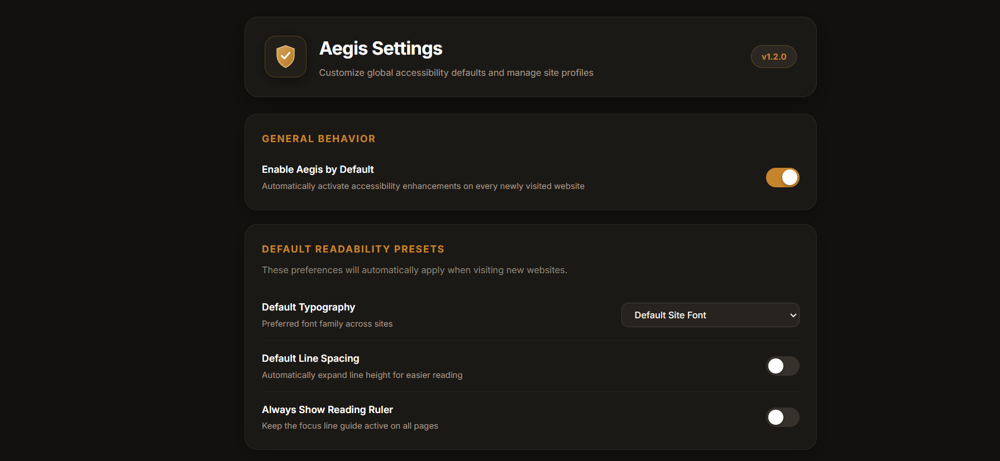
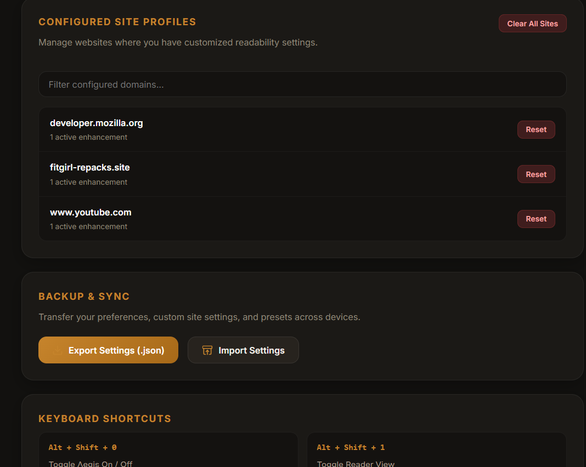

# Aegis 🛡️
### *Universal Accessibility, Visual Comfort & Readability Toolkit*

<p align="center">
  
</p>

<p align="center">
  <strong>Transform any website into an accessible, readable, and distraction-free sanctuary.</strong>
</p>


---

## 🌟 Overview

The modern web is often cluttered with sensory overload: aggressive autoplay media, low-contrast text, overwhelming sidebars, unreadable typefaces, and poor accessibility structures that fail basic WCAG standards.

**Aegis** is an open-source, client-side accessibility and cognitive readability suite designed specifically for:
- 🧠 **Neurodivergent readers** (ADHD, autism, executive dysfunction).
- 📖 **Individuals with dyslexia** seeking high-legibility letterforms and spacing.
- 👁️ **Visual stress & Irlen syndrome** sufferers needing soft color overlays to mitigate glare.
- 🎨 **Users with color vision deficiencies** (Deuteranopia, Protanopia, Tritanopia, Achromatopsia).
- 👓 **Low-vision individuals** requiring WCAG AAA contrast, text magnification, and structural highlights.
- 🎧 **Auditory learners** needing seamless background Text-to-Speech (Read Aloud).

---

## 📸 Screenshots & Interface Showcase

### 1. Aegis in Action on Web Applications
*Reading aloud YouTube page content with active tab status, health score, and on-page floating speech controller.*

<p align="center">
  
</p>

<p align="center">
  
</p>
---

### 2. Dashboard, Typography & Audio Assistance
*Clean dark-gold UI showing real-time website detection, WCAG health score, font scaling, and instant speech synthesis.*

<p align="center">
  
</p>


---

### 3. Visual Comfort, Color Tints & Reading Aids
*Smart Dark Mode, High Contrast (WCAG AAA), Visual Stress Tints, Color Blind Simulation, Reader View, and Focus Dimming.*

<p align="center">
  
</p>

---

### 4. Real-Time WCAG Accessibility Auditor
*Deep inspection of webpage DOM elements: missing image alt text, broken heading hierarchies, unlabeled buttons, and missing form labels.*

<p align="center">
  
</p>

---

### 5. Settings & Configured Site Profiles Manager
*Dedicated options dashboard for setting global readability presets, managing site-by-site overrides, and importing/exporting backups.*

<p align="center">
  
</p>

<p align="center">
  
</p>


---

## ⚡ Core Feature Modules

### 🔊 1. Native Audio Assistance (Text-to-Speech)
Aegis features a rock-solid, background-driven speech synthesis engine powered by Chrome's native `chrome.tts` API:
- **Zero Autoplay Restrictions**: Unlike standard in-page Web Speech APIs that fail due to browser autoplay policies, Aegis speaks cleanly across any web page.
- **Continuous Background Playback**: Speech continues playing smoothly even after you close the extension popup.
- **Smart Text Extraction**:
  - Highlights a specific paragraph? Aegis reads **only your selection**.
  - Inside Reader View? Aegis reads the **clean article body**.
  - Normal browsing? Aegis intelligently parses the **main article content**, automatically filtering out navigation menus, ads, headers, and footer clutter.
- **Automatic Sentence Chunking**: Seamlessly splits long articles into manageable sentence buffers, preventing Chrome's speech synthesizer from timing out on long passages.
- **On-Page Floating Controller**: A floating pill appears at the bottom-right of the screen (`🔊 Reading Aloud... | ⏸ Pause | ⏹ Stop`) allowing instant playback control without opening any menus.

---

### 🔍 2. Automated WCAG Page Accessibility Auditor
Instant on-page diagnostics to evaluate how accessible any website truly is:
- 🖼️ **Image Inspection**: Identifies images missing critical `alt` descriptions.
- 📑 **Heading Hierarchy Check**: Validates `h1` through `h6` progression, flagging missing primary titles or skipped heading levels (e.g. `h2` jumping straight to `h4`).
- 🔘 **Interactive Element Labels**: Flags icon buttons and links missing text or `aria-label` tags.
- 📝 **Form Field Associations**: Audits input fields, textareas, and dropdowns lacking `<label for="...">` or `aria-labelledby` linkages.
- 🎯 **Algorithmic Health Score**: Generates a clear, color-coded accessibility health percentage (`0%` to `100%`) directly inside the dashboard.

---

### 📖 3. Distraction-Free Reader View
Strips away commercial distractions and transforms messy web pages into pure editorial content:
- **Intelligent Article Extraction**: Heuristically locates the primary article body while removing banners, sidebars, cookie notices, and ads.
- **Sticky Reader Toolbar**:
  - **✕ Exit**: One-click return or press <kbd>Esc</kbd>.
  - **Themes**: Switch instantly between **Light**, **Warm Sepia**, **Charcoal Dark**, and **OLED Night**.
  - **Typography Sizing**: Rapid `A-` and `A+` font size adjusters.
  - **Live Metadata**: Automatic word count and estimated reading time calculator (e.g., `850 words · ~4 min read`).
  - **Listen**: Direct integration with the Text-to-Speech engine.

---

### 🧠 4. Cognitive & Focus Aids (ADHD & Dyslexia)
- **Interactive Reading Ruler**: A mouse-following horizontal line guide that creates a focused visual reading track, preventing line-skipping and visual disorientation.
- **Focus Dimming**: Selectively fades secondary distractions (headers, navigation, sidebars, advertisements, comment sections) to 25% opacity while keeping the primary article highlighted at 100%.
- **OpenDyslexic Font Support**: Switch typography to weighted-bottom letterforms designed to alleviate character confusion and flipping.
- **Micro-Typography Tuning**:
  - **Line Height**: Expanded to `1.85x` for optimal eye-tracking.
  - **Letter Spacing**: Extended to `0.08em` to prevent crowding.
  - **Word Spacing**: Expanded to `0.16em` to clarify word boundaries.
- **Document Anchoring**: Highlighting toggles for all hyperlinks and structural headings to facilitate rapid document scanning.

---

### 🎨 5. Visual Comfort & Color Perception
- **Smart Dark Mode**: Employs an intelligent CSS inversion algorithm that preserves media fidelity — photos, videos, canvases, and vector icons remain undistorted while blinding white canvases turn into dark backgrounds.
- **WCAG AAA High Contrast**: Supercharges visual contrast (`165%`) with reinforced text weight and underlined hyperlinks for low-vision accessibility.
- **Visual Stress Tints (Irlen Syndrome)**: Soft color overlays that neutralize screen glare and reduce perceptual visual stress:
  - 🍂 *Warm Sepia* (`#f4ecd8`)
  - 🌸 *Soft Rose* (`#ffe4e6`)
  - 🍃 *Mint Green* (`#d1fae5`)
  - ❄️ *Ice Blue* (`#e0f2fe`)
  - ☀️ *Pale Yellow* (`#fef08a`)
- **Color Blind Simulation Filters**: Hardware-accelerated SVG matrix filters for:
  - **Deuteranopia** (Green-blind)
  - **Protanopia** (Red-blind)
  - **Tritanopia** (Blue-blind)
  - **Achromatopsia** (Total color blindness / Monochromatic Grayscale)

---

### ⚙️ 6. Site Profiles & Complete Data Privacy
- **Automatic Per-Site Storage**: Aegis remembers your custom preferences per website domain. Turn on Dark Mode on Wikipedia and Reading Ruler on Reddit — each site keeps its own state.
- **Global Defaults**: Option to enable Aegis automatically on all newly visited websites.
- **Site Profiles Manager**: A dedicated settings view where you can search, view, and reset individual website customizations.
- **JSON Backup & Restore**: Export your settings to a portable `.json` file and restore them across any computer.
- **100% Client-Side Privacy**: Aegis collects zero telemetry, communicates with zero external servers, and stores all preferences locally in Chrome's sandboxed storage.

---

## ⌨️ Default Keyboard Shortcuts

| Shortcut | Function | Context |
| :--- | :--- | :--- |
| <kbd>Alt</kbd> + <kbd>Shift</kbd> + <kbd>0</kbd> | **Toggle Aegis On / Off** | Global (Any tab) |
| <kbd>Alt</kbd> + <kbd>Shift</kbd> + <kbd>1</kbd> | **Toggle Reader View** | Active web page |
| <kbd>Alt</kbd> + <kbd>Shift</kbd> + <kbd>2</kbd> | **Toggle Focus Mode** | Active web page |
| <kbd>Alt</kbd> + <kbd>Shift</kbd> + <kbd>3</kbd> | **Toggle Text-to-Speech (Read Aloud)** | Active web page |
| <kbd>Esc</kbd> | **Exit Reader View** | When in Reader View |

> [!TIP]
> Chrome allows you to customize or rebind all shortcut keys at any time by visiting:
> ```text
> chrome://extensions/shortcuts
> ```

---

## 🛠️ Technology Stack & Architecture

Aegis is engineered with zero runtime dependencies for maximum speed, security, and battery efficiency:

```
Aegis/
├── manifest.json            # Manifest V3 specification & permissions
├── background/
│   └── background.js        # Service worker: Native Chrome TTS engine & shortcut dispatcher
├── content/
│   └── content.js           # Accessibility engine, DOM visual injection & on-page speech bar
├── popup/
│   ├── popup.html           # Extension dashboard interface
│   ├── popup.css            # Dark gold aesthetics, responsive typography & animations
│   └── popup.js             # Live state coordinator & WCAG automated auditor
├── settings/
│   ├── settings.html        # Options page & configured site profiles manager
│   ├── settings.css         # Options theme styles
│   └── settings.js          # Global preset management & JSON data backup
├── screenshots/             # Interface screenshots for documentation
└── assets/
    └── icons/               # High-contrast SVG iconography suite
```

### Key Architectural Decisions:
1. **Manifest V3 Service Worker**: The background worker manages `chrome.tts` and extension badge states without keeping idle background processes running.
2. **REM-Based Text Scaling**: Avoids the classic compounding `1em` bug where nested lists and links multiply font sizes exponentially.
3. **Selective Opacity Focus**: Instead of dimming root containers, Aegis targets non-essential elements (`nav`, `header`, `aside`, `footer`, `.ad`, `.comments`), preventing main content from getting trapped in parent opacity ceilings.
4. **Isolated Native TTS**: Decoupled from tab autoplay policies, ensuring instant, audible speech output.

---

## 🔒 Permissions & Security Transparency

Aegis only requests permissions that are strictly necessary for its accessibility functionality:

| Permission | Technical Justification |
| :--- | :--- |
| `storage` | Saves user accessibility preferences and per-site configurations locally on your machine. |
| `activeTab` | Grants temporary script access to apply readability styles to the active tab when clicked. |
| `scripting` | Programmatically injects accessibility stylesheets and reading overlays. |
| `tabs` | Reads `tab.url` to detect the website domain and display the active site in the dashboard. |
| `tts` | Uses Chrome's native speech engine for background-safe Read Aloud playback. |
| `<all_urls>` | Enables accessibility and readability enhancements across any website you visit. |

---

## 🚀 Installation Guide

### Loading Unpacked in Google Chrome

1. **Download or Clone** this repository to your local computer:
   ```bash
   git clone https://github.com/your-username/aegis.git
   ```
   

2. Open **Google Chrome** and navigate to:
   ```text
   chrome://extensions
   ```

3. Enable **Developer mode** using the toggle in the top-right corner.

4. Click **Load unpacked** in the top-left corner.

5. Select the **`Aegis`** project root directory.

6. Pin **Aegis** 🛡️ to your Chrome toolbar for instant one-click accessibility!

---

## 🤝 Contributing & Feedback

Contributions are welcome! If you have suggestions for new accessibility features (e.g. additional dyslexia fonts, specialized contrast themes, or language translations):
1. Fork the repository.
2. Create a descriptive feature branch (`git checkout -b feature/new-contrast-theme`).
3. Commit your enhancements (`git commit -m 'Add solarized contrast theme'`).
4. Push to your branch (`git push origin feature/new-contrast-theme`).
5. Open a Pull Request.

---


<p align="center">
  Built with ❤️ for a more accessible, inclusive, and readable web.
</p>
